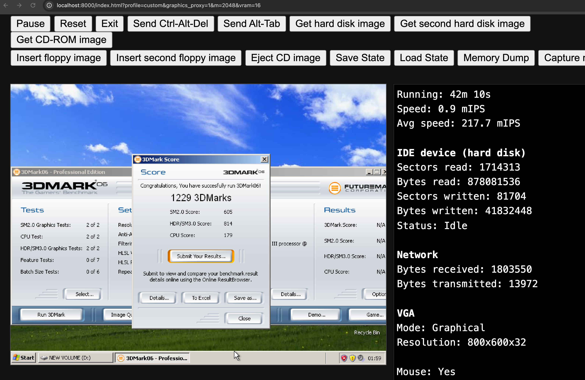

# Graphics proxy quick start

## 1. What is `v86gl_pci.js`?

[`src/v86gl_pci.js`](../src/v86gl_pci.js) implements a custom virtio PCI device
in v86. It receives graphics commands from the Windows guest driver and passes
them to the browser graphics renderer, which uses WebGPU.

Enable **Enable graphics proxy (WebGPU)** in `index.html` or `debug.html`.

## 2. Get the driver and DLLs

Sources and binaries are in
[retro-gaming-site/glbridge](https://github.com/speedyHKjournalist/retro-gaming-site/tree/main/glbridge):

- `v86gl_driver/v86gl-virtio.sys`
- `openglproxy/opengl32.dll`
- `ddrawproxy/ddraw.dll`
- `d3d8proxy/d3d8.dll`
- `d3d9proxy/d3d9.dll`

## 3. Install the driver in Windows 2000/XP

Rename `v86gl-virtio.sys` to `v86gl.sys` and copy it to
`C:\WINDOWS\system32\drivers`. When updating, close the game and run
`sc stop v86gl` before replacing the file.

Run these commands as Administrator:

```bat
sc create v86gl type= kernel start= demand binPath= C:\WINDOWS\system32\drivers\v86gl.sys

sc qc v86gl
sc start v86gl
```

The current build scripts target XP; Windows 2000 compatibility is unverified.

## 4. Install the graphics DLLs

Copy the DLLs needed by the game into the same folder as its `.exe`:
`opengl32.dll` for OpenGL, `ddraw.dll` for DirectDraw, `d3d8.dll` for Direct3D 8,
or `d3d9.dll` for Direct3D 9.

## 5. Build the driver and DLLs

Install the 32-bit MinGW-w64 toolchain (`i686-w64-mingw32-gcc`, `objdump`, and
`windres`), including its DDK headers and kernel import libraries.
From the `retro-gaming-site` repository root, run:

```sh
sh glbridge/v86gl_driver/build.sh
sh glbridge/openglproxy/build.sh
sh glbridge/ddrawproxy/build.sh
sh glbridge/d3d8proxy/build.sh
sh glbridge/d3d9proxy/build.sh
```


## 6. Tested games and applications

The following games and applications have been tested with the graphics proxy:

- **OpenGL:** GLView 2.6.0, Warcraft III (OpenGL mode), Cube 2 Sauerbraten.
- **DirectDraw:** 3DMark 99 MAX, Diablo II.
- **Direct3D 7:** 3DMark 2000.
- **Direct3D 8:** 3DMark 2001 SE, MapleStory v083.
- **Direct3D 9:** 3DMark06, KartRider, Warcraft III, Grand Theft Auto: San Andreas, Need for Speed: Most Wanted (2005).


